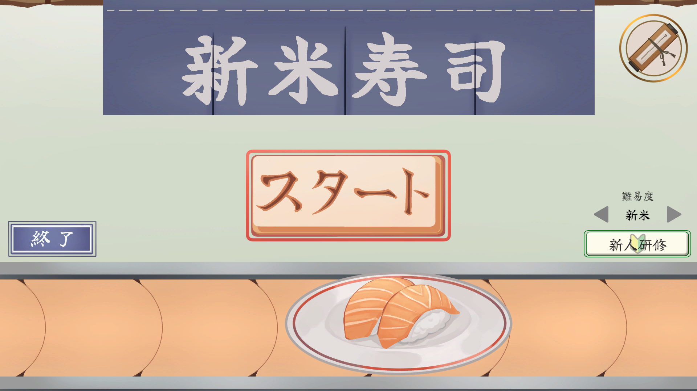
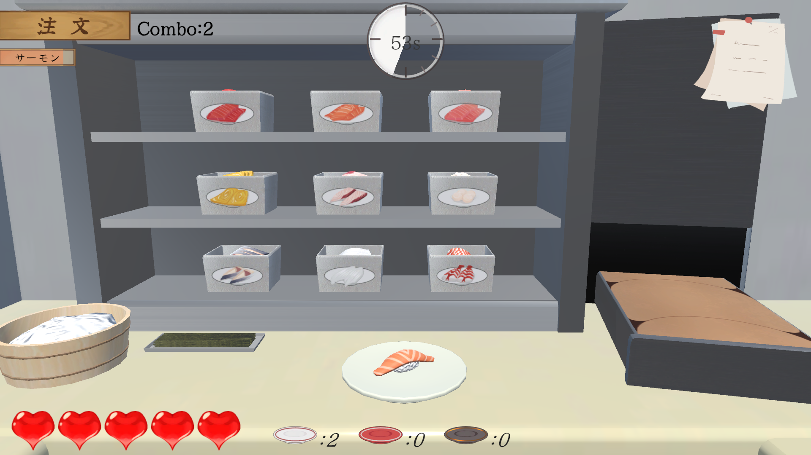
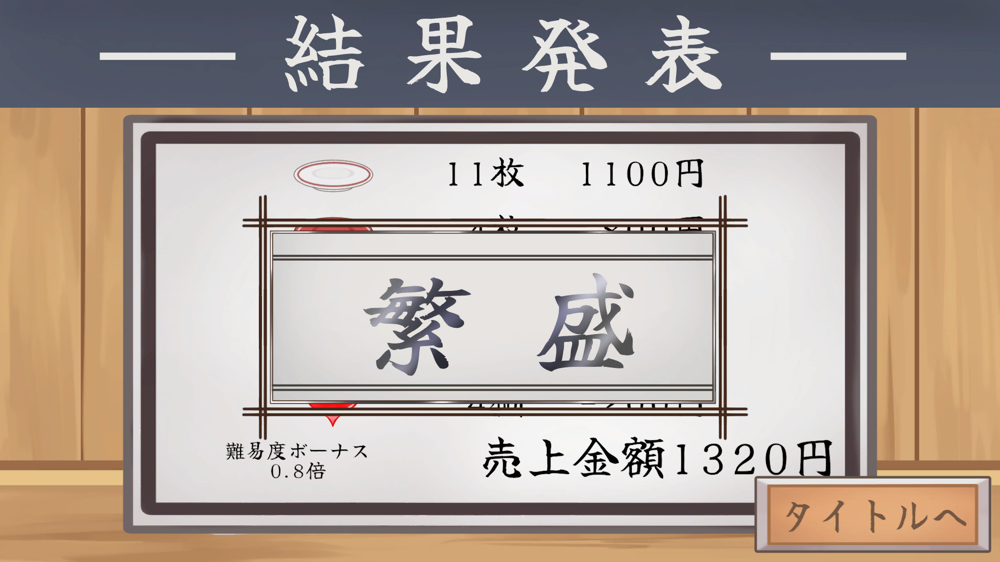

# 「新米寿司」

## Download
* [ShinmaiZushi_v2.0](https://github.com/c24012/ShinmaiZushi/releases/tag/v2.0)

## ファイル構成  
* [UnityのScript](./UnityFiles)  
* [スクリーンショット](./ScreenShot)
* [紹介動画](./movie)

## ゲーム概要  

### ジャンル  
回転寿司屋での調理シミュレーター

### ゲームルール  
お客さんの注文通りにお寿司作って提供する寿司屋シミュレーションゲームです。
マニュアルを読みながら時間内に注文をこなしていき、どんどん早くなる注文に焦りや
混乱を感じながら楽しんでもらうのがこのゲームの目的です。
また、最終的な売り上げをランキングとして競うこともできます。

### プラットフォーム  
Windows11 キーボード＆マウス操作

### Unityバージョン  
Unity 2022.3.24f1

## 担当ブログラム 
### こだわったスクリプト
* 
  
### 担当スクリプト一覧
*

### 制作での工夫

## 制作概要  
### メンバー（役割）  
* 新垣 大空（プログラマー）  
* 大城 一世（プログラマー）  
* 上地 妃咲（デザイナー）  
* 嘉手苅 陽凪（デザイナー）

### 制作期間
２か月

## スクリーンショット  
  
  

